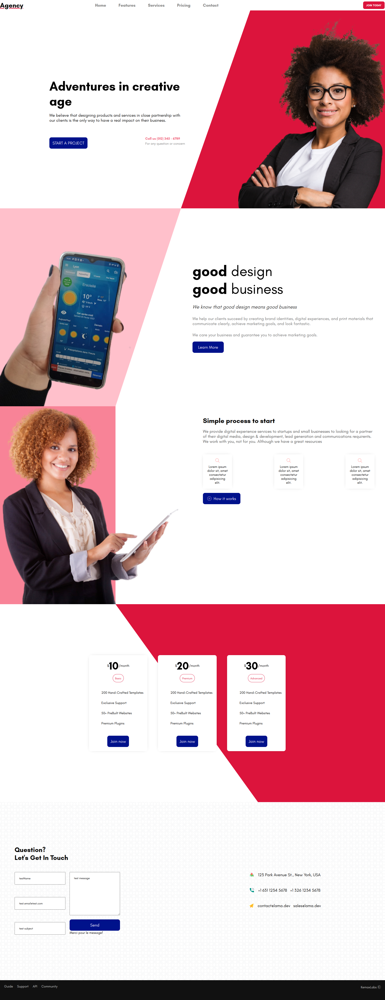

base on this vidéo : https://www.youtube.com/watch?v=9_s_Essow6s&t=322s

the begining

```shell
yarn create react-app lama-tuto-002
yarn add -D prettier
yarn add styled-components
yarn add @emailjs/browser
```

 `.prettierrc`

```json
{
    "semi": false,
    "tabWidth": 2,
    "singleQuote": true
}
```


how to play this project

```shell
yarn
yarn start
```


---

dans ce projet j'ai aussi utilise l'extension [ES7+ React/Redux/React-Native snippets](https://marketplace.visualstudio.com/items?itemName=dsznajder.es7-react-js-snippets)

shortcut `ctrl`+`alt`+`r`  => `rafce`  

google it: clip path generator: https://bennettfeely.com/clippy/

https://www.toptal.com/designers/subtlepatterns/

smoothScroll : https://www.youtube.com/watch?v=yg9We54OxmE

> https://github.com/john-smilga/react-nuggets


## Inspiration

* [ ] https://www.sliderrevolution.com/resources/css-animated-background/
